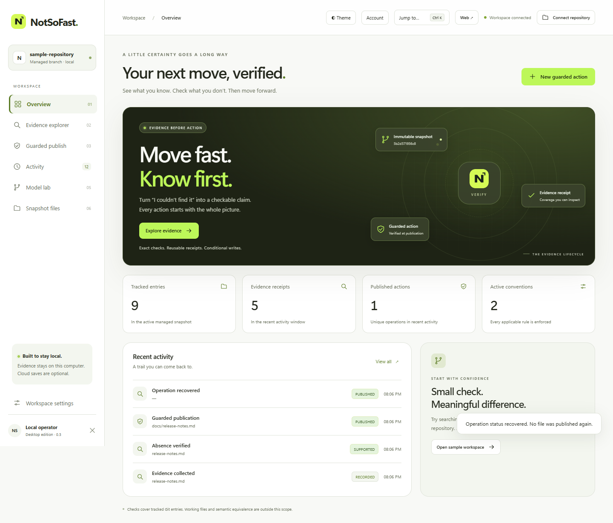
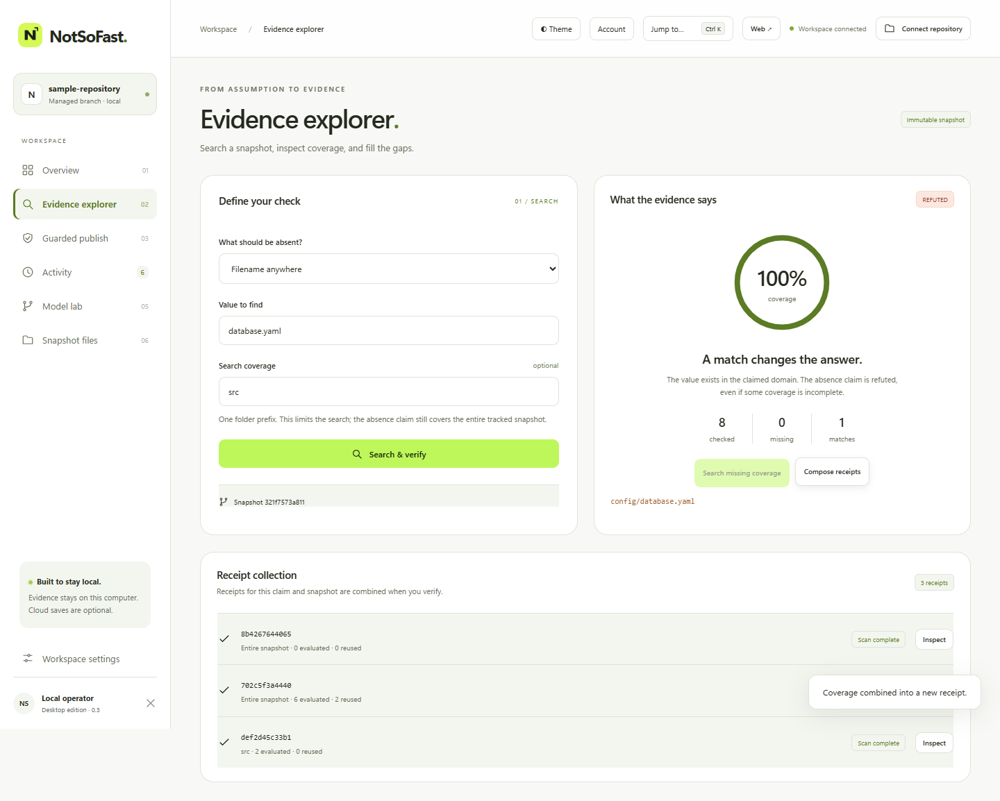
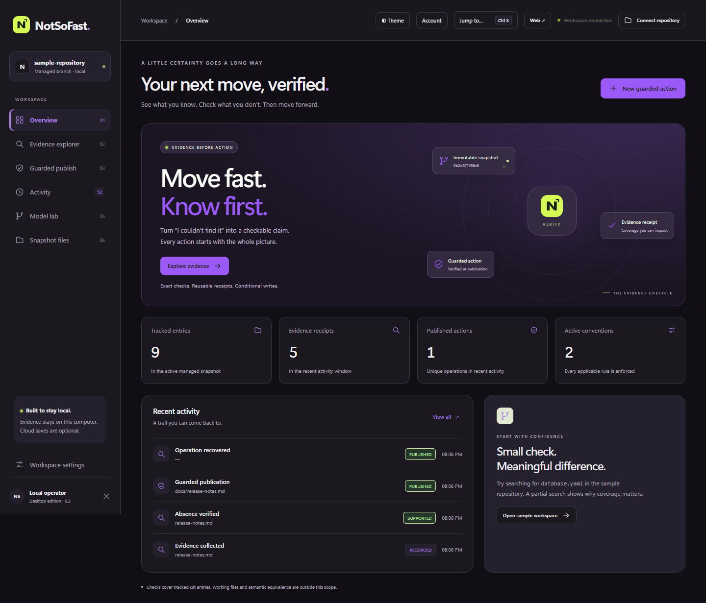
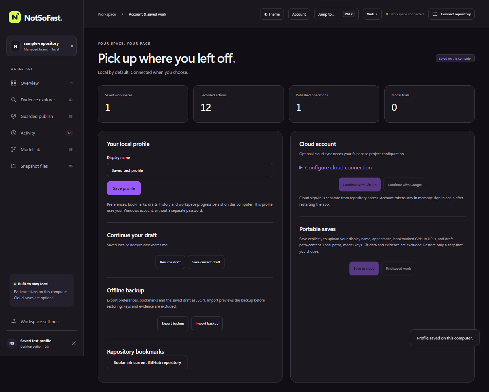
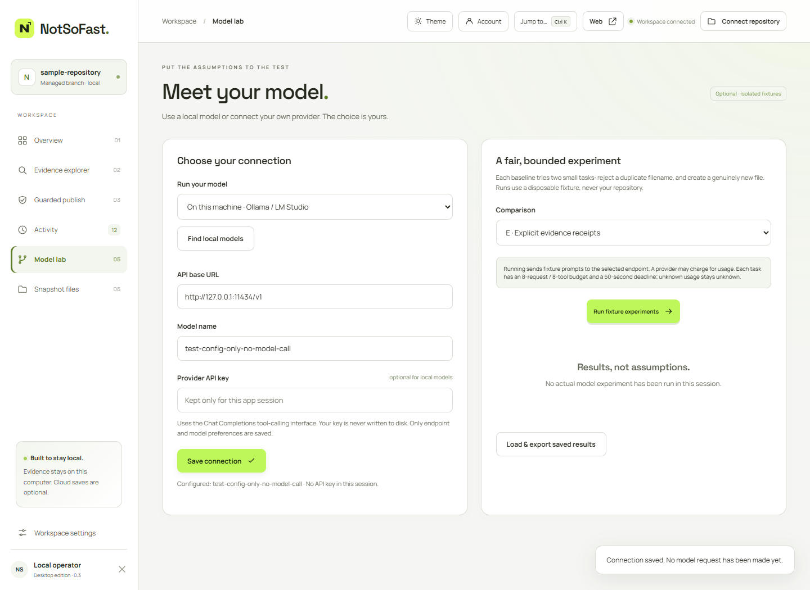
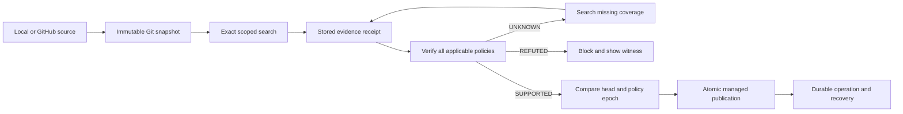

<div align="center">

# NotSoFast
### Move fast. Know first.

**An evidence workspace for state-changing AI agent actions.**

[Get started](#start-with-the-app) · [GitHub repositories](#connect-a-github-repository) · [Model lab](#choose-your-model) · [Architecture](docs/ARCHITECTURE.md) · [API](docs/PROTOCOL.md)

</div>



NotSoFast makes a narrow but useful question explicit: **have we checked enough of this exact Git snapshot to justify this action?** Search coverage becomes reusable evidence. A guarded publication creates one file only when every applicable policy passes against the managed head.

A search of `src/` cannot prove that `database.yaml` is absent everywhere. NotSoFast returns **UNKNOWN**, finds the missing coverage, and returns **REFUTED** when it discovers `config/database.yaml`. This enforces exact naming and byte-content conventions; it does not infer semantic equivalence or establish general agent safety.

## Start with the app

For the separate public product website, see the [Vercel deployment guide](docs/DEPLOYMENT.md). Deploy only `website/`; it requires no secrets. The guide includes release-upload commands, dashboard settings, CLI deployment and your remaining account setup.

**Recommended:** run `dist/NotSoFast-Setup.exe`. The setup wizard installs both launchers and bundled runtimes, adds Start menu entries, offers a desktop shortcut, and registers an uninstaller in Windows Settings. Installation is per Windows user and requires no administrator access. Use the app's **Quit** button before updating or uninstalling. Uninstall keeps saved work. This development build is not code-signed.

The Windows portable build produces `dist/NotSoFast-Windows-x64.zip`. Extract the **entire folder**, then choose:

| Launcher | Experience |
| --- | --- |
| `NotSoFast.exe` | Dedicated desktop window, with browser fallback |
| `NotSoFast-Web.exe` | The complete website in your default browser |

Both use the same local workspace and embedded frontend. **No terminal, Node, Python, Go, API key, or GPU is needed to use the packaged app.** Keep the `git` and `github` folders beside the executables. The desktop window uses Microsoft Edge when available.

1. Open either launcher.
2. Try the sample workspace, select a local Git folder, or paste a GitHub repository URL in **Workspace settings**.
3. Open **Evidence explorer** to search, inspect coverage, compose receipts, or fill gaps.
4. Use **Guarded publish** to prepare a path and content, review the result, and publish.
5. Browse files, inspect the operation in **Activity**, and download the managed snapshot.

**Publication changes the app's managed Git branch. It does not edit your original working tree or push to GitHub.** Local imports use committed `HEAD`; uncommitted changes are excluded. Reconnecting an existing local workspace retains its managed head. It does not merge later source commits. Importing a changed GitHub default-branch commit creates another managed workspace.

Closing a window leaves the local service available. Use **Quit** to stop it. Reopening either launcher reconnects to the running app. **Web ↗** in the app opens an authenticated browser session.

### What is included

| Area | Features |
| --- | --- |
| Overview | Live connection, snapshot and activity counts; animated evidence visualization |
| Evidence | Exact paths, basenames and literal bytes; scope coverage; composition; missing-domain search |
| Publication | Policy checks, content review, explicit publish, durable operation IDs and recovery |
| Files | Path filtering, pagination, immutable text preview and download; binary detection |
| Workspaces | Sample, native local folder picker, GitHub URL import, recent repositories and ZIP export |
| Model lab | Local server discovery or provider configuration; isolated model trials; result export |
| Navigation | Responsive layout, keyboard command palette (`Ctrl/Cmd K`), visible errors and reduced motion |



## Make it yours

Choose **Theme** for **Daylight**, **After hours**, or **Match system**, then pick **Citrus, Tidal, Iris, Bloom, or Ember**. Preferences persist across launches and browser windows after refresh. Animation respects the OS and in-app reduced-motion settings.



**Account** provides a local display name, aggregate insights, saved drafts and GitHub bookmarks. Draft edits save locally after a short pause; **Save current draft** provides an explicit save. Resuming a draft still requires fresh verification in the selected workspace.

Use **Offline backup** to export your profile as JSON or preview and restore a previous backup. Backups include appearance, bookmarks and draft content; store them somewhere private. They do not contain repositories, evidence or credentials. Remove individual bookmarks from Account. The theme dialog scrolls on small screens and offers **Reset preview** before saving.

See the [UI validation report](docs/UI-VALIDATION.md) for browser checks and integrations still requiring your configuration.

## Cloud account setup

Local saving works without an account. Optional cross-device saving uses your own Supabase project with GitHub or Google OAuth. This sign-in is separate from GitHub repository access.

Follow the [cloud setup guide](cloud/README.md): apply [the database schema](cloud/schema.sql), enable your OAuth provider, configure allowed loopback redirects, then enter the project URL and **public publishable/anon key** in Account. OAuth secrets stay in Supabase; never enter a service-role key in the app.

**Save to cloud** explicitly uploads your name, appearance, GitHub bookmarks and draft path/content. On another computer, sign in, find saved work, preview a snapshot and restore it. Git repositories, receipts, publication authority, local paths and model keys remain local. Reopen a GitHub bookmark and verify again to continue there. Insights are calculated from local history.

Cloud saves are separate snapshots, not continuous background synchronization. The ten newest saves are retained. Cloud tokens remain in memory; sign in again after restarting. Local work stays available offline.

**Status:** the integration and contract tests are implemented. No live project configuration has been supplied, so hosted OAuth and deployed database policies remain unverified.



## Connect a GitHub repository

In **Workspace settings → GitHub URL**, paste `https://github.com/owner/repository`.

- **Public repository:** import directly; sign-in is optional.
- **Private repository:** select **Sign in with GitHub**, copy the one-time code shown, and authorize it on GitHub's browser page. Then import the URL.
- **Another snapshot:** import the URL again to obtain the latest default-branch commit. Existing local managed workspaces remain in recent workspaces.

Authentication uses the official bundled GitHub CLI's OAuth device flow. You do not need to create an OAuth application or paste a personal access token. Organization restrictions and SSO authorization still apply. Only `github.com` HTTPS repository URLs are supported; branch/file URLs, arbitrary hosts and embedded credentials are rejected.

Imports are bare repositories containing default-branch history. Hooks are disabled; submodules and Git LFS content are not fetched or executed. Network imports time out after 50 seconds, with a 96 MiB temporary-download cancellation threshold and the core's 64 MiB packed/expanded import limit. Large repositories can fail even when their visible source is small.

The app uses its own GitHub configuration directory. GitHub CLI uses the OS credential store when available and may fall back to its configuration file. **Disconnect** removes this app's account configuration; it retains imported workspaces and does not revoke the OAuth grant. Revoke the GitHub CLI grant in GitHub account settings if needed. Never share the app data directory.

## Choose your model

**Model lab** offers two choices:

| Choice | Setup |
| --- | --- |
| Local model | Run an existing Ollama or LM Studio server, use **Discover**, select its model, and save |
| Provider | Enter an OpenAI-compatible API base URL, model name and optional API key, then save |

The adapter requires Chat Completions tool calling. HTTPS is required for remote endpoints; local HTTP is accepted on loopback. Providers with incompatible APIs or models without tool support will not work. No model is downloaded automatically.

API keys stay in memory for the current app session; the endpoint and model preferences persist. Re-enter the key after restarting. Saving an empty key clears it. Trials send a small disposable fixture rather than your connected repository. A provider may charge for these calls.

Run the selected baseline, or compare A–E: destination-only direct action, destination-only search, fresh enforced evaluation, memoized evaluation, and explicit receipts. Trials are bounded to eight model calls, eight tool calls and 50 seconds each. Stop finishes the current trial before cancelling the remaining batch. Export the results to retain a comparison.

**Validation distinction:** scripted provider-contract tests pass, but no real model experiment has been completed on this development machine because no running local model or provider credentials were configured. Scripted results are not AI-model performance evidence.



## How evidence controls an action



| Decision | Meaning |
| --- | --- |
| `SUPPORTED` | Trusted coverage establishes the exact claim for this snapshot and domain |
| `REFUTED` | A matching witness disproves the absence claim |
| `UNKNOWN` | Coverage or usable evidence is insufficient; it is not permission to publish |

Receipts are service-owned references, not client-authored proof documents. Reuse is keyed to deterministic inputs. Publication verifies the expected head and active policy epoch atomically. Operation IDs support retries and lost-response recovery. See the [guarantee matrix](docs/ARCHITECTURE.md) for the actual trust assumptions.

## Browser and desktop troubleshooting

| Symptom | Resolution |
| --- | --- |
| Website appears disconnected | Open `NotSoFast-Web.exe` or the desktop **Web ↗** button. A plain URL in a new tab lacks the launch capability. The reconnect page explains this. |
| Opened `index.html` and nothing works | Start the launcher. The website needs the embedded local service; a standalone HTML file cannot provide it. |
| Old browser bookmark stopped working | The port and secure session change after restart. Use the launcher again. |
| GitHub sign-in unavailable | Extract the complete package, including `github/bin/gh.exe`. Development builds need `gh` on PATH. |
| Private import fails | Check account access, organization/SSO restrictions, URL, connection and size limits. |
| Local folder does not import | Select a Git repository with at least one commit; commit desired working-tree changes first. |
| Model discovery finds nothing | Start your local model server, or configure a compatible provider. |
| Another window changed workspace | Refresh the page; workspace-bound requests deliberately reject a stale selection. |
| App is busy | Let the current bounded operation finish, then retry. Operations are serialized. |

The app listens only on `127.0.0.1` with a random port. A random launch capability, exact Host/Origin checks and a restrictive content security policy protect the browser API. Do not share secure launch links. This is a **local website**, not a deployed public website or multi-user service.

App data lives in `%APPDATA%\NotSoFast` by default: settings, GitHub configuration, imported repositories, evidence, operation history and model results. Use the `-data` launcher flag for a separate profile. Each profile permits one running instance. Core state defaults to 512 MiB per workspace; desktop metadata is capped at 64 MiB. File previews are capped at 1 MiB and desktop creations at 64 KiB. Imported workspaces accumulate until you remove their app-owned data while the app is stopped; there is no automatic disk-retention policy.

## Build the Windows installer and portable package

Requirements: Go with CGO enabled, GCC and `windres`, PowerShell, and internet access for pinned runtime archives.

```powershell
./scripts/build-desktop.ps1
./scripts/build-installer.ps1 -SkipDesktopBuild
```

This embeds the frontend and Windows icon, links the executable's C runtime statically, verifies pinned MinGit/GitHub CLI archive checksums, and creates both launchers plus the ZIP. The build does not require a frontend package manager. Build tools are not needed by the recipient.

The installer uses Windows' existing .NET Framework compiler. It includes a native setup wizard, per-user shortcuts, upgrade checks and a manifest-based uninstaller. Cleanup rejects symbolic links and junctions, and preserves application data. No third-party installer compiler is needed.

For development on other platforms:

```sh
go build -o .tools/notsofast ./cmd/notsofast
.tools/notsofast -browser
```

Install Git and optionally GitHub CLI separately there. The tested portable distribution is Windows x64; other desktop platforms are not validated to the same extent.

## Verification and evidence

Tests exercise real Git/SQLite state, HTTP boundaries, competing publications, recovery, invalid receipts and browser interactions. Browser checks cover the secure launch screen, sample import, file preview, command palette, incomplete/refuted coverage, blocked and successful publication, ZIP export, recovery, reload, model settings and narrow-screen reduced motion.

```sh
go test -race ./...
python python/test_integration.py
python python/test_mcp_sdk.py
python python/test_desktop.py
# Windows, with no existing registered installation:
python python/test_installer.py
```

The MCP compatibility test requires the official Python MCP SDK. Browser checks require Playwright and an installed browser; set `NSF_DESKTOP_EXE` to the built executable and `NSF_BROWSER` to `msedge`, `chrome` or `chromium`. `NSF_MINIMAL_PATH=1` checks the Windows package with only system directories on the child process PATH. Set `NSF_GITHUB_INTEGRATION=1` to include the live public GitHub import test.

[Latest race checks](docs/desktop-followup-tests.txt) · [Browser checks](docs/browser-followup-results.json) · [Installer checks](docs/installer-results.json) · [Five-run measurements](docs/repeated-results.json) · [Fuzz results](docs/fuzz-results.txt) · [CI](https://github.com/bhavishy2801/NotSoFast/actions)

Measurements do not establish a receipt-specific speed advantage over ordinary memoization. Five 32-file runs recorded literal-query medians around 5692 ms fresh, 404 ms memoized and 394 ms with receipts on unchanged inputs. Cold checks remained about 5.5 seconds. Runs used an uncontrolled development host, a fixed method order and warm OS caches; they are informational rather than statistical proof. Raw CPU/process and sampled-memory measurements are retained, including outliers.

Power-loss durability, every agent host, actual private-account OAuth authorization and real-model performance are not claimed as validated. Docker is unavailable on the development host; a runtime integration check is supplied for environments with Docker. The app remains a trusted-developer, single-instance tool whose enforcement depends on use of the gateway.

---

## Developer quick start

Requirements: Go 1.24 or newer, a C compiler for SQLite/Go's race detector, Git supporting reference transactions (tested with 2.55.0.windows.3), and Python 3.10+. No model credentials, GPU, or paid service is needed.

From a clean checkout:

```sh
go mod download
go test -race ./...
mkdir -p .tools
go build -o .tools/nsf ./cmd/nsf
python python/test_integration.py
python python/demo.py
python python/evaluate.py
```

On Windows PowerShell, use `New-Item -ItemType Directory -Force .tools` and build to `.tools/nsf.exe`. This workspace includes a verified official compiler at `.tools/go/bin/go.exe`; it is excluded from source distribution. Set `CGO_ENABLED=1` if your environment disables it. GCC must be on PATH. The demos create temporary fixture repositories and state, launch the actual service, and clean up their own files.

All six demos are assertions over real operations: incomplete search, composition, concurrent publication, incremental reuse, forged evidence, and lost-response recovery. Saved output is in [docs/demo-results.json](docs/demo-results.json).

## Use your repository

Copy `config.example.json` to a private configuration file. Set the allowed `repositories.demo` path to an existing local repository and `root` to a dedicated service-owned directory. Select the full commit ID with `git rev-parse HEAD` in that source repository. Do not put the managed state inside an agent-writable directory for enforced use.

The trusted local CLI accepts one JSON request on stdin:

```sh
echo '{"repository":"demo","snapshot":"FULL_COMMIT_ID"}' | .tools/nsf -config config.json -user local register
echo '{"repository":"demo"}' | .tools/nsf -config config.json -user local head
```

PowerShell accepts the same single-quoted JSON; use `.tools/nsf.exe`. The CLI is a trusted operator interface: `-user` is not network authentication. Run one process against a state directory at a time. A SQLite lease rejects another service/CLI instance while one is running.

For HTTP, set `NSF_TOKEN` to a random value of at least 24 characters, then start:

```sh
.tools/nsf -config config.json -user local serve
```

The default address is `127.0.0.1:8787`. The token is mapped to the configured `local` principal. Requests use `Authorization: Bearer ...`; no browser origins are accepted. Operators may instead configure a private token-to-principal map. Never commit tokens.

```python
import os, sys
sys.path.insert(0, "python")
from notsofast import Client
c = Client(token=os.environ["NSF_TOKEN"])
print(c.call("head", repository="demo"))
```

See [protocol and examples](docs/PROTOCOL.md) for all operations. Byte fields use standard Base64. Receipt IDs are references; the service never accepts agent-authored receipt bodies.

## Policies

The sample configuration requires basename uniqueness for every creation. Files below `markers/` additionally require absence of literal `owned: demo` in regular blobs, and must contain that marker. **Every applicable destination-prefix policy is enforced.** Selecting a policy ID cannot disable another policy. Marker creations therefore need evidence for both conventions.

Policies and principal grants are frozen per process and activated as a Git policy epoch. The publication transaction verifies both the old branch head and that epoch. A stale process cannot publish after a new epoch has become active. Old successful operations remain recognizable on retries; no new mutation is performed for them.

## MCP

Run `python python/mcp_adapter.py` with `NSF_URL` and `NSF_TOKEN`. It implements newline-delimited stdio MCP 2025-11-25 initialization, tools/list, tools/call, and ping. It forwards to HTTP; it has no Git or evidence-store access requirement. Tested with the included protocol client against a live service, not with every agent host. Calls are sequential and bounded by the HTTP timeout; cancellation notifications do not interrupt an already running Python HTTP call.

For process separation, `compose.yaml` supplies a service container and an optional MCP client container without state/source mounts. Set `NSF_SOURCE` to the allowed source repository and `NSF_TOKEN`, then run `docker compose up --build nsf`. The source is mounted read-only; service state has its own named volume. `docker compose run --rm -T mcp` starts the adapter. Docker execution has not been validated on the development host because Docker is unavailable.

## Evidence and measured value

The early experiment did **not** establish a receipt-specific speed advantage. Ordinary memoization and receipts reuse the same unchanged inputs. Full fresh filename checks can be faster than either. Receipts are positioned around explicit coverage, composition, traceability and recovery, with conventional memoization underneath.

[Evaluation](docs/EVALUATION.md) links raw measurements, scripted controls, ablations and limitations. The optional provider-neutral [model harness](python/model_harness.py) takes a JSON driver command; no model experiment was run. Scripted trials are not model trials.

## Documentation

- [Architecture, trust model and guarantee matrix](docs/ARCHITECTURE.md)
- [Predicate, scope and API definitions](docs/PROTOCOL.md)
- [Recovery and retention](docs/RECOVERY.md)
- [Measurements and reproduction](docs/EVALUATION.md)
- [Implementation audit](AUDIT.md)
- [Related work](docs/RELATED_WORK.md)
- [Original requirements](docs/SPEC.md) and [implementation plan](docs/PLAN.md)
- [MIT license](LICENSE) and [dependency notices](THIRD_PARTY_NOTICES.md)

This is a trusted-developer, single-instance local tool. Protection is conditional on gateway use in a same-user local setup. No power-loss durability or machine-checked proof is claimed. See the audit for validation limits and open performance work.
