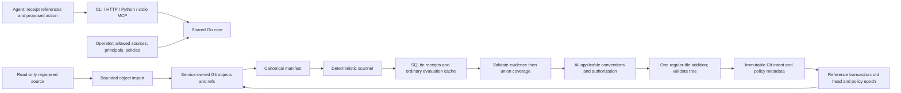

# Architecture and guarantees

The core is `core/`. `protocol/` only decodes requests and formats responses; `cmd/nsf` is the local entry point. Python/MCP only transport data. No dashboard, microservices, distributed scanners or natural-language policy evaluator exists.

## Trust boundary

Trusted: operator configuration, service binary, scanner, manifest builder, Git executable and object store, SQLite, local OS and filesystem. The registered source is a trusted developer's local repository. Agents select allowed IDs and full commits, never source paths or Git options. Commands use argument arrays, sanitized Git environment, disabled hooks/fsmonitor/global/system config, an empty allowed-protocol list and disabled lazy fetching. No checkout, filters, source-index update or external push occurs.

Network principals have repository-wide read grants and a write grant. This release does not offer sub-repository redaction/ACLs. Unauthorized receipt IDs and missing IDs return the same unavailable-evidence reason. Evidence binds principal and its grants; a grant change invalidates old receipt access identity. Every applicable policy is required, and policy/grant activation is part of the publication consistency boundary.

Hashes identify content and catch accidental changes; they do not prove an untrusted scanner ran correctly. An attacker with write access to the authoritative store is inside the trusted boundary. Cryptographic attestation of outsourced scanning is not implemented.

The local CLI can impersonate configured principals and can reach the state directory. It is for trusted operators. A cooperative agent with the same filesystem permissions can bypass the service. For an enforced deployment, isolate the client process/container and do not mount the state, source, operator config or Docker socket into it. The supplied Compose layout expresses that separation but was not executed on this host.

## Limits and resource model

Default HTTP capacity is four admitted requests, with zero pending queue; excess requests get `BUSY`/429. Scanner and mutation work serialize within one service. This is not horizontal scalability. Each Git child has a 30-second timeout and capped output (64 MiB, stderr 8 KiB); HTTP work has a 60-second deadline. A timed-out/cancelled search cannot issue new authoritative evidence. Partition cold large searches to fit the deadline.

Default regular blob evaluation limit: 4 MiB. Oversized blobs produce `UNEVALUATED`, not absence. Limits include 100,000 manifest entries, 256 receipt references, four manifests' worth of inherited evaluations, 32 MiB serialized receipt bodies, 2 MiB HTTP requests, UTF-8 paths up to 4096 bytes/256 components. Large responses require explicit expansion; default receipt responses omit evaluation sets, default verification responses cap path lists at 100 and include counts.

Default storage budget is 512 MiB. Admission reserves 128 MiB plus one eighth of the configured budget; SQLite is capped at one eighth (4 KiB pages), with WAL checkpoint controls. Imports preflight at most one million reachable objects and 64 MiB total expanded object bytes, then enforce a 64 MiB pack-output cap. These conservative limits preserve room for index/WAL/candidate writes. No automatic garbage collection or receipt eviction exists; exhaustion fails closed and requires operator capacity intervention. Filesystem overhead, concurrent external writers and hostile source resource exhaustion are outside the trusted-local bound; use an OS/container quota for a strict physical disk/memory ceiling. Compose additionally sets memory, process and CPU limits.

## Correctness argument

Assume complete authoritative manifests, correct deterministic evaluation, authentic stored receipts, correct set operations, current operator policy binding, and Git's conditional reference transaction semantics. For a claim domain D, the verifier unions successfully evaluated identities into E and matching identities into M only after checking every receipt's identity, semantics, access, integrity and membership. A match in D refutes absence. Otherwise support requires D to be a subset of E; every element of D is therefore known not to match. An empty D comes only from the authoritative manifest. Duplicate/overlapping receipts cannot enlarge a set; outside-domain witnesses do not refute a narrower claim.

Creation checks every applicable convention on S, validates exactly one regular-file addition, binds the candidate to requester/payload, and publishes only if the branch still names S and the policy epoch remains active. Absence is intentionally consumed by the creation; it is not required afterward. This is a correctness argument under assumptions, not a machine-checked proof or universal bug-freedom claim.

| Guarantee | Assumptions | Evidence | Failure behavior / exclusions |
|---|---|---|---|
| Exact scoped absence | Complete tracked-tree manifest; supported predicate | Scope, empty-domain, witness, corruption tests | UNKNOWN/INVALID_EVIDENCE; no semantic equivalence |
| Coverage composition | Trusted compatible receipts | Duplicate/overlap tests and scope fuzzing | Missing entries remain missing; contradictions rejected |
| Incremental agreement | Immutable predicate-relevant inputs | Independent oracle over real Git; add/delete/rename/type tests | Changed/new inputs evaluated; stale snapshot receipts invalid |
| Authorization and policy binding | Protected immutable config and store | HTTP auth, unauthorized receipt, weaker-policy and epoch tests | Fail closed; no protection against store/CLI bypass |
| One-file conditional publication | Managed append-only branch; Git transaction | Raw-delta validation, candidate limit and concurrent tests | STATE_CHANGED, POLICY_CHANGED or UNRESOLVED; no unconditional fallback |
| Retry identity | Retained Git intents/records; intact objects | Conflict, restart, partial-ref and termination tests | Same payload returns same candidate; different payload rejected |
| Process-crash recovery | Git/filesystem remain usable | Before/after exit, prepare-kill, commit-kill attempts, synthetic partial refs | Pending/ambiguous intent stays UNRESOLVED; stale locks may need repair |
| Power-loss durability | Not established | Not tested | No guarantee for power failure, disk loss, malicious rollback |

Every row is bounded by its assumptions. Zero failures in these tests are not a general safety claim.
